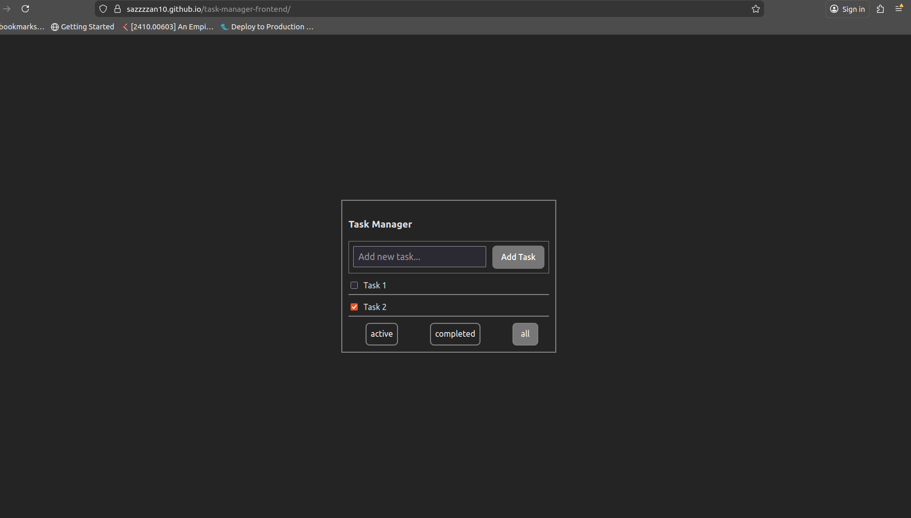

##  Live Demo

You can view the live version of this project here:  
 https://sazzzzan10.github.io/task-manager-frontend/

---

##  Project Reflection

The most challenging part of this project was managing state updates correctly and making sure tasks were saved and loaded reliably using `localStorage`, especially during page reloads. I am proud of the clean, mobile-first UI design and the way the app responds smoothly across different screen sizes while remaining accessible. If I were to continue this project, my next steps would be to add delete task feautre, a backend for user accounts and persistent storage, migrate the codebase to typeScript for better type safety, and improve testing and performance.

## Live Screenshot

